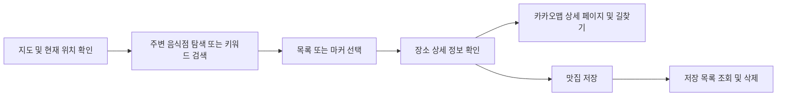
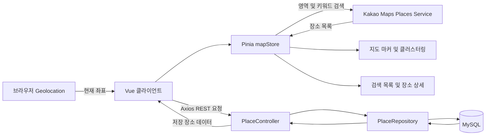

# EatWhere (지도 기반 맛집 탐색 및 저장 서비스)

> EatWhere는 현재 위치와 지도 영역을 기반으로 음식점을 탐색하고, 관심 있는 장소를 저장해 다시 찾아볼 수 있는 **지도 기반 맛집 탐색 서비스**입니다.

---

## 1. 프로젝트 개요

**EatWhere**는 “어디에서 먹을까?”라는 고민에서 출발해, 주변 음식점 탐색부터 장소 정보 확인과 저장까지 한 화면에서 이용할 수 있도록 구성한 프로젝트입니다.

**카카오맵 기반 지도**와 **Vue 기반 인터페이스**를 연결해 지도 이동에 따라 주변 음식점을 조회하고, 검색 결과와 지도 마커를 함께 표시합니다. 선택한 장소는 **Spring Boot와 MySQL**을 통해 저장하며, 저장 목록에서 다시 확인하거나 삭제할 수 있습니다.

- **서비스 형태** : 지도 기반 웹 애플리케이션
- **프로젝트 구성** : Vue 프론트엔드 + Spring Boot 백엔드
- **핵심 구현** : 지도 영역 기반 음식점 검색, 마커 클러스터링, 장소 상세 정보 및 저장 목록 관리

---

## 2. 주요 기능

- **현재 위치 기반 지도** : 브라우저 위치 정보를 이용해 지도를 초기화하고, ‘내 위치’ 버튼으로 현재 위치로 이동
- **지도 영역 기반 주변 검색** : 지도 이동·확대·축소가 끝나면 현재 화면 영역의 음식점을 카카오맵 카테고리 검색으로 조회
- **키워드 검색** : 지역명이나 장소명으로 검색하고, 검색 성공 시 첫 번째 결과 위치로 지도 이동
- **지도 마커 및 클러스터링** : 검색 결과를 지도 마커로 표시하고, 지도를 축소하면 가까운 마커를 묶어 표현
- **검색 목록과 지도 연동** : 사이드바에서 장소를 선택하면 해당 좌표로 이동하고, 마커 또는 목록 선택 시 상세 정보 표시
- **장소 상세 정보** : 장소명과 주소를 표시하고, 장소 URL이 있는 경우 카카오맵의 사진·리뷰 페이지로 연결
- **길찾기 연결** : 선택한 장소의 이름과 좌표를 이용해 카카오맵 길찾기 페이지로 연결
- **맛집 저장 및 조회** : 선택한 장소의 이름·좌표·주소·상세 URL을 DB에 저장하고 저장 목록 갱신
- **저장 목록 관리** : 저장된 장소를 다시 선택해 확인하거나, 삭제 확인 후 목록에서 제거
- **저장 중복 안내** : 클라이언트에 로드된 저장 목록에서 같은 이름의 장소가 있는지 확인하여 중복 저장 안내

위치 정보를 사용할 수 없는 경우에는 **대구 좌표(35.8714, 128.6014)**를 기준으로 지도를 초기화합니다. 주변 음식점 검색은 한 번에 최대 15개 결과를 요청합니다.

### 이용 흐름



---

## 3. 기술 스택

### Frontend

- **Framework & Build** : `Vue 3`, `Vite 8`
- **Language** : `JavaScript`, `HTML`, `CSS`
- **State Management** : `Pinia 4`
- **Network** : `Axios`
- **Map & Search** : `Kakao Maps JavaScript SDK`, `Places Service`, `MarkerClusterer`
- **Location** : 브라우저 `Geolocation API`
- **Development Tools** : `Vue DevTools`, `vite-plugin-vue-devtools`

Vue는 `package.json`에서 `rc`로 지정되어 있으며, 현재 lockfile에는 `3.6.0-rc.6`이 기록되어 있습니다. Vue Router는 등록되어 있지만 현재 화면은 `App.vue`에서 직접 구성하며, 별도 라우트는 정의되어 있지 않습니다.

### Backend

- **Language & Framework** : `Java 17`, `Spring Boot 4.1.1`
- **Web** : `Spring Web MVC`, `REST API`
- **Database & ORM** : `MySQL`, `Spring Data JPA`, `Hibernate`
- **Library** : `Lombok`
- **Build** : `Gradle Wrapper 9.7.1`
- **Test** : `JUnit Jupiter`, `Spring Boot Test` 기반 애플리케이션 컨텍스트 로딩 테스트

---

## 4. 시스템 아키텍처 및 데이터 흐름

**외부 장소 탐색**과 **저장한 장소 관리**를 두 흐름으로 구성했습니다. 주변 음식점과 키워드 검색은 브라우저에서 카카오맵 SDK로 처리하고, 저장·조회·삭제는 Spring Boot REST API를 통해 MySQL에 반영합니다.



### 지도 상태와 검색 결과 연동

`Map.vue`는 지도 조작이 끝나는 `idle` 이벤트에서 중심 좌표와 남서·북동 경계 좌표를 `mapStore`에 전달합니다. 스토어는 해당 영역을 기준으로 음식점 카테고리 코드 `FD6`을 검색하고 결과를 화면에서 사용하는 장소 데이터로 변환합니다.

검색 목록이 바뀌면 기존 마커와 클러스터를 정리한 뒤 새 결과를 표시합니다. 클러스터링은 지도 레벨 5부터 적용합니다. 목록이나 마커를 선택하면 `selectedPlace`와 `targetCoord`를 갱신해 상세 창과 지도 이동을 연결합니다.

### 저장 장소 관리

`PlaceDetail.vue`에서 선택한 장소를 저장하면 백엔드의 `PlaceController`가 요청을 받고, `PlaceRepository`를 통해 DB에 반영합니다. 저장 또는 삭제가 완료되면 전체 저장 목록을 다시 조회해 사이드바를 갱신합니다.

현재는 컨트롤러에서 Repository를 직접 호출하는 구조이며, 별도의 서비스 계층은 없습니다.

### REST API

| Method | 경로 | 기능 |
| --- | --- | --- |
| GET | `/api/places` | 남서·북동 경계 좌표 사이의 DB 저장 장소 조회 |
| POST | `/api/places` | 장소 저장 |
| GET | `/api/places/all` | 저장된 전체 장소 조회 |
| DELETE | `/api/places/{id}` | ID에 해당하는 저장 장소 삭제 |

영역 조회의 쿼리 파라미터는 `swLat`, `swLng`, `neLat`, `neLng`입니다. 해당 API와 프론트엔드 호출 함수는 구현되어 있지만, **현재 지도 이동 시 사용하는 검색은 카카오맵 카테고리 검색**입니다.

### 데이터 모델 및 구현 범위

| 모델 | 주요 필드 | 현재 사용 범위 |
| --- | --- | --- |
| `Place` | `id`, `name`, `lat`, `lng`, `address`, `placeUrl` | 장소 저장·조회·삭제에 사용 |
| `Review` | `id`, `rating`, `content`, `imageUrl`, `createdAt`, `place` | 장소와 다대일 관계를 갖는 엔티티 정의 |

현재 저장 목록은 사용자 계정별로 분리되지 않는 **공용 목록**입니다. 자체 리뷰 등록·조회 API와 리뷰 작성 화면은 구현되어 있지 않으며, 화면의 ‘사진/리뷰 보기’는 카카오맵 외부 페이지로 연결됩니다.

개발 환경의 API 주소는 `http://localhost:8080`으로 지정되어 있으며, 백엔드는 프론트엔드 출처 `http://localhost:5173`을 허용하도록 설정되어 있습니다.

---

## 5. 폴더 구조

프론트엔드와 백엔드는 별도 프로젝트로 구성되어 있으며, 이 문서는 두 프로젝트를 함께 설명합니다.

<details>
<summary><b>Frontend (eatwhere-front) 구조 보기</b></summary>

```text
├── src/
│   ├── api/
│   │   └── place.js             # 장소 조회·저장·삭제 API 호출
│   ├── components/
│   │   ├── Map.vue              # 지도·위치 정보·마커·클러스터링
│   │   ├── SearchBar.vue        # 키워드 입력 및 검색
│   │   ├── ListSidebar.vue      # 검색 결과 목록
│   │   ├── SavedSidebar.vue     # 저장 목록 조회 및 삭제
│   │   └── PlaceDetail.vue      # 장소 상세·외부 링크·저장
│   ├── stores/
│   │   └── mapStore.js          # 지도·검색·선택 장소·저장 목록 상태
│   ├── router/
│   │   └── index.js             # 라우터 초기 설정, 현재 routes 비어 있음
│   ├── App.vue                 # 지도와 사이드바 등 전체 화면 구성
│   └── main.js                 # Vue·Pinia·Router 등록
├── index.html                  # Kakao Maps SDK 로딩
├── package.json                # 의존성 및 실행 스크립트
├── package-lock.json           # 의존성 버전 고정
└── vite.config.js              # Vue·DevTools 플러그인 및 경로 별칭
```

</details>

<details>
<summary><b>Backend (eatwhere-back) 구조 보기</b></summary>

```text
├── src/
│   ├── main/
│   │   ├── java/com/eatwhere/eatableback/
│   │   │   ├── controller/
│   │   │   │   └── PlaceController.java       # 장소 REST API
│   │   │   ├── entity/
│   │   │   │   ├── Place.java                 # 저장 장소 엔티티
│   │   │   │   └── Review.java                # 리뷰 엔티티 및 장소 연관관계
│   │   │   ├── repository/
│   │   │   │   └── PlaceRepository.java       # CRUD 및 좌표 범위 검색
│   │   │   └── EatWhereBackApplication.java   # 서버 진입점
│   │   └── resources/
│   │       └── application.yaml              # 서버·MySQL·JPA 설정
│   └── test/java/com/eatwhere/eatableback/
│       └── EatWhereBackApplicationTests.java # 컨텍스트 로딩 테스트
├── gradle/wrapper/                            # Gradle Wrapper
├── gradlew
├── gradlew.bat
├── settings.gradle
└── build.gradle                              # 의존성 및 Java 빌드 설정
```

</details>
